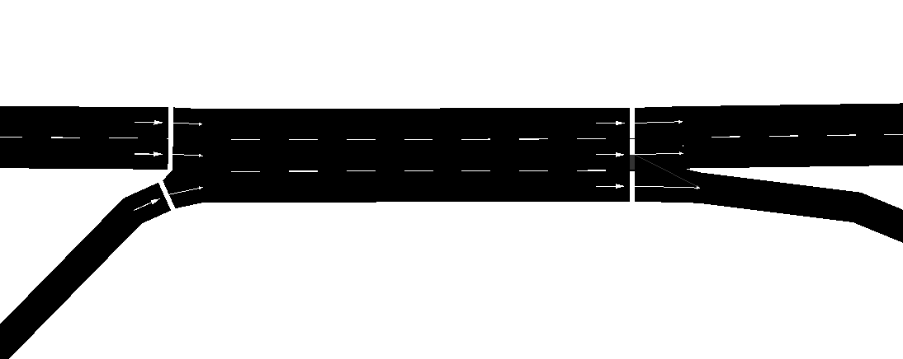

# Motorway Simulation

This page describes simulations of motorways in SUMO. It aims to collect
best practices when modelling motorway networks and traffic.

# Building a network for motorway simulation

Networks can be imported from any supported data source or created from
scratch with [netedit](../netedit.md). Depending on the level of
detail special processing may be necessary

## Motorway ramps

If the network does not contain detailed ramp data,
[netconvert](../netconvert.md) can be [configured to add them
heuristically](../Networks/Further_Options.md#guessing_on-_and_off-ramps).
This basically adds acceleration at on-ramps and deceleration lanes at
off-ramps.

Ramps usually merge into the main road via an acceleration lane. This acceleration lane opens up where the ramp enters the motorway and is modelled as a dead-end lane (no outgoing connection). This forces on-ramp vehicles to change lanes in order to continue their route.

It may be useful to make acceleration lanes in SUMO somewhat longer than in reality.
This compensates the cautious default behavior of SUMO drivers: Vehicles on the acceleration lane will decelerate when approaching the end of that lane since they cannot anticipate with certainty whether their lanechange will be successful. In contrast, human drivers are better at predicting the future and may accelerate up to the end of the acceleration lane (and then change into the anticipated gap at the last moment)

### Reduction in the number of lanes

The usual way to set up a lane-number reduction is to configure one of the lanes
as a dead-end (no connection to the next edge) and force
vehicles to change-lanes. In some situations it may be
appropriate to declare the node where the lane number changes as a
[zipper node](../Networks/PlainXML.md#node_types)
instead.

### Combined On-Off-Ramps

Combined ramps are those where the acceleration lane from an on-ramp
becomes the deceleration lane for a nearby off-ramp. This forces
vehicles into a weaving pattern where entering and exiting vehicles need
to swap lanes. This type of situation may cause deadlocks in
[sumo](../sumo.md) unless preventive measures are taking. The
problem is exacerbated if the acceleration/deceleration lane is short or
traffic is very dense.

To prevent deadlocks the connection pattern shown in the following image
should be used. Note, that the off-ramp is targeted by the two rightmost
lanes of the preceding edge and lane 0 has priority over lane 1.
Vehicles exiting the motorway will attempt to move to the rightmost lane
if possible but can still continue their route if that lane is occupied.

Connectivity at on-off-ramp

You can can create this kind of connectivity in [netedit connection mode](../netedit.md#changing_connections]) with Ctrl+Click.

!!! note
    A similar problem can be found in some types of multi-lane roundabouts. The same solution is applicable.

## Vehicle class specific speed limits

In some jurisdictions, certain vehicle classes have specific speed
limits (i.e. Trucks which may not drive faster than 90km/h on German
motorways). This should be modelled as described here:
[Networks/PlainXML#vehicle-class_specific_speed_limits](../Networks/PlainXML.md#vehicle-class_specific_speed_limits)

## Lane-changing prohibitions

Symmetrical lane-changing prohibitions between two lanes can be modelled
by adding a thin lane with attribute `disallow="all"` between them.

!!! note
    One-sided prohibitions currently cannot be modelled.

# Defining Motorway Traffic

## Speed Distributions

To achieve a realistic scenario, the desired vehicle speeds should be
heterogeneous. This can be achieved by setting the [vType-attributes
speedFactor and
speedDev](../Definition_of_Vehicles,_Vehicle_Types,_and_Routes.md#speed_distributions).
Since a vehicle *speedFactor* defines desired speed relative to the
speed limit of each edge,
[\#Vehicle_class_specific_speed_limits](#vehicle_class_specific_speed_limits)
should be taken into account.

## High Flows

Some tips on how to achieve high flows are described [in the
FAQ](../FAQ.md#how_do_i_get_high_flowsvehicle_densities)
